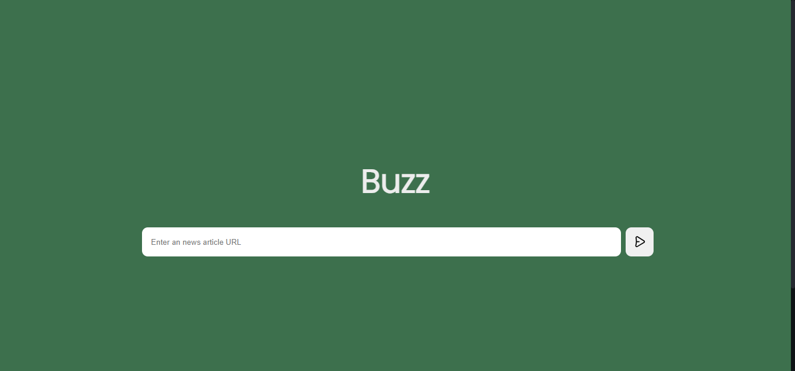

# Buzz 📰




## Project Overview & Technologies

- This project aims to predict the topic of a given news article using Latent Semantic Analysis (LSA) and Latent Dirichlet Allocation (LDA). 
- It also compares the performance of both algorithms using t-Distributed Stochastic Neighbor Embedding (TSNE) to plot the clusters. 
- The project leverages the [Newspaper3K library](https://github.com/codelucas/newspaper) to fetch news articles, Flask for the web interface, and [FinBERT](https://huggingface.co/ProsusAI/finbert) for financial sentiment analysis. 
- To ensure efficiency, multiprocessing is used to run each model as a separate process.

## Features

- **Topic Prediction**: Predicts the topic of a given news article using LSA and LDA by spitting out predicted keywords.
- **Web Interface**: Intuitive web interface to interact with the Flask server.
- **Multiprocessing**: Runs each model as a separate process to enhance efficiency.
- **Sentiment Analysis**: Uses FinBERT API to predict the sentiment of the news article.
- **Automatic Data Fetching**: Uses Kaggle's CroissantML format to automatically download and store the data in parquet format.

## Installation

- ****

## Usage

1. **Run the Flask server**:
    ```sh
    python app.py
    ```

2. **Access the web interface**:
    Open your web browser and go to `http://127.0.0.1:5000`.

3. **Predict the topic**:
    - Enter the news article text in the provided input field.
    - Click the "Predict Topic" button to get the predicted topic using both LSA and LDA.
    - View the TSNE visualization to compare the performance of the two models.

## Project Structure

- `app.py`: The main Flask application.
- `models.py`: Contains the LSA and LDA model implementations.
- `news_fetcher.py`: Uses the News3K library to fetch news articles.
- `templates/`: Directory containing the HTML template for the web interface.
- `static/`: Directory for static files (e.g., CSS, JavaScript).
- `requirements.txt`: List of required Python packages.

## Dependencies

- Flask
- News3K
- scikit-learn
- gensim
- numpy
- pandas
- matplotlib
- seaborn
- TSNE
- multiprocessing

## Contributing

1. Fork the repository.
2. Create a new branch (`git checkout -b feature-branch`).
3. Make your changes.
4. Commit your changes (`git commit -m 'Add new feature'`).
5. Push to the branch (`git push origin feature-branch`).
6. Create a new Pull Request.

## License

This project is licensed under the MIT License. See the [LICENSE](LICENSE) file for details.
